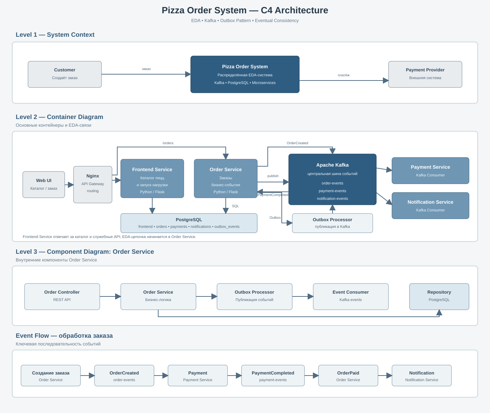
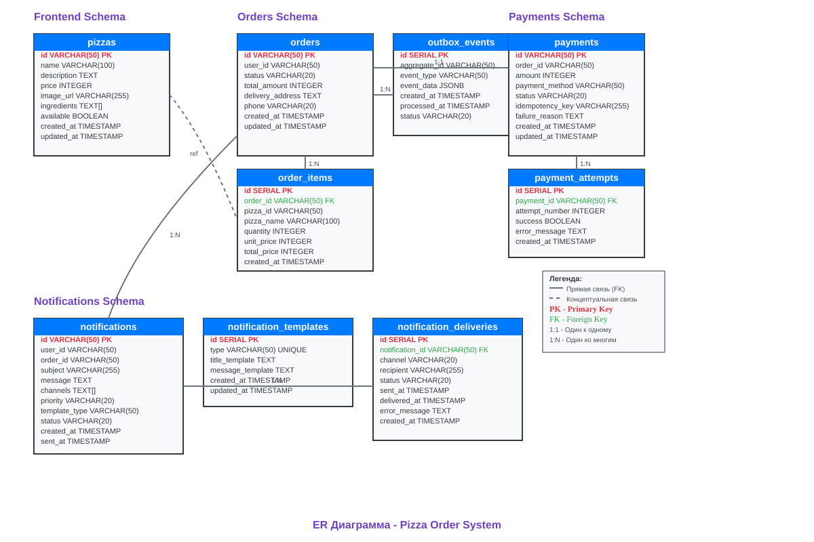

# 🍕 Pizza Order System — EDA Lab

Учебный стенд для изучения **Event-Driven Architecture (EDA)** на примере распределённой системы обработки заказов.

Здесь вы изучаете взаимодействие микросервисов через **события и Kafka**, **Outbox Pattern**, **Eventual Consistency**, асинхронную обработку и поведение распределённой системы под нагрузкой.

> **Главная тема стенда — EDA. Observability используется, чтобы увидеть и объяснить работу этой архитектуры.**

---

## 1. Что вы изучаете



На практике вы разберёте:

- Event-Driven Architecture и асинхронное взаимодействие;
- Kafka и Publish/Subscribe;
- Outbox Pattern;
- Eventual Consistency;
- идемпотентность, retry и DLQ;
- взаимодействие нескольких микросервисов через события;
- работу EDA-системы под нагрузкой.

Главный принцип:

```text
Сервис создаёт событие
        ↓
      Kafka
        ↓
Другие сервисы реагируют
```

В отличие от длинной цепочки синхронных вызовов, сервисы взаимодействуют через события и остаются слабо связанными.

---

## 2. Основной EDA-поток


Это центральный сценарий стенда: заказ создаётся в Order Service, событие сохраняется через Outbox, публикуется в Kafka, после чего его обрабатывают несколько сервисов.

Подробный сценарий находится в [Message Flow](docs/message_flow.md).
---

## 3. Как работает Outbox

Order Service сохраняет бизнес-данные и событие в одной транзакции:

```text
PostgreSQL
 ├─ orders
 ├─ order_items
 └─ outbox_events
        ↓
      COMMIT
        ↓
Outbox Processor
        ↓
      Kafka
```

Это защищает систему от ситуации, когда заказ уже сохранён в БД, а событие не дошло до Kafka.

Для изучения Outbox особенно важна таблица:

```text
orders.outbox_events
```

---

## 4. Eventual Consistency

Состояние разных сервисов меняется последовательно, а не одновременно:

```text
OrderCreated
    ↓
Kafka
    ↓
Payment Service
    ↓
PaymentCompleted
    ↓
Order Service
    ↓
OrderPaid
```

Поэтому некоторое время разные компоненты могут видеть разное состояние. Со временем система приходит к согласованному состоянию.

При нагрузке это особенно заметно через **consumer lag**.

---

## 5. Роли компонентов

| Компонент | Роль |
|---|---|
| **Frontend Service** | Интерфейс и запуск нагрузки |
| **Order Service** | Работа с заказами и бизнес-событиями |
| **Outbox Processor** | Публикация Outbox-событий в Kafka |
| **Payment Service** | Обработка платежных событий |
| **Payment Mock** | Имитация внешней платёжной системы |
| **Notification Service** | Реакция на события и уведомления |
| **PostgreSQL** | Бизнес-данные и Outbox |
| **Kafka** | Асинхронная шина событий |

---

## 6. Kafka

Kafka — центральный элемент EDA-архитектуры.

Основные топики:

```text
order-events
payment-events
notification-events
dlq-events
```

В [Kafka UI](http://localhost:18080) можно посмотреть реальные события, partitions, offsets, consumer groups и lag.

Пример цепочки:

```text
OrderCreated
     ↓
PaymentCompleted
     ↓
OrderPaid
```

---

## 7. Нагрузка 1000 RPS

На главной странице есть кнопка:

**⚡ Нагрузочный тест 1000 RPS**

Нагрузка создаёт поток запросов примерно на одну минуту:

```text
HTTP
 ↓
Order Service
 ↓
PostgreSQL / Outbox
 ↓
Kafka
 ↓
Payment / Notification
```

Одновременно можно наблюдать:

```text
HTTP Rate
Kafka Message Rate
Consumer Lag
Latency
Errors
CPU / Memory
PostgreSQL Activity
```

---

## 8. Observability

После изучения EDA используйте observability, чтобы исследовать её поведение.

| Инструмент | Что показывает |
|---|---|
| **Grafana** | Графики и состояние системы |
| **Prometheus** | Исходные метрики и PromQL |
| **Kafka UI** | Реальные сообщения и consumer groups |
| **pgAdmin** | Реальные данные PostgreSQL и Outbox |
| **cAdvisor** | Ресурсы Docker-контейнеров |
| **Node Exporter** | Ресурсы хоста |
| **Kafka Exporter** | Метрики Kafka |
| **PostgreSQL Exporter** | Метрики PostgreSQL |
| **Nginx Exporter** | Метрики Nginx |

Главный вопрос:

> **Что произошло с EDA-системой под нагрузкой и почему?**

---

## 9. Grafana

**http://localhost:3000**

```text
Login:    admin
Password: admin
```

Основные dashboards:

| Dashboard | UID | Назначение |
|---|---|---|
| Overview | `overview` | Общее состояние системы |
| Kafka | `kafka` | Messages, lag, broker |
| Services | `services` | Работа микросервисов |
| PostgreSQL | `database` | Состояние БД |
| Infrastructure | `infrastructure` | Ресурсы инфраструктуры |
| RED | `red-metrics` | Rate, Errors, Duration |
| USE | `use-metrics` | Utilization, Saturation, Errors |
| LTES | `ltes-metrics` | Latency, Traffic, Errors, Saturation |
| CPU by Service | `cpu-by-service` | CPU по контейнерам |

---

## 10. PostgreSQL

**http://localhost:8081**

```text
Login:    pgadmin@pgadmin.org
Password: admin
```

Подключение к базе:

```text
Host:     localhost
Port:     5433
Database: pizza_system
User:     pizza_user
Password: pizza_password
```

Для подключения из pgAdmin:

```text
Host:     host.docker.internal
Port:     5433
Database: pizza_system
User:     pizza_user
Password: pizza_password
```



Особенно интересны:

```text
orders
order_items
outbox_events
payments
payment_attempts
notifications
```

---

## 11. Prometheus

**http://localhost:9090**

Быстрые проверки:

```promql
up
```

```promql
up{job="node-exporter"}
```

```promql
node_load1
```

HTTP traffic:

```promql
sum(rate(http_requests_total{service!=""}[5m]))
```

Kafka traffic:

```promql
sum(rate(kafka_messages_sent_total[5m]))
```

Consumer lag:

```promql
sum(kafka_consumergroup_lag_sum)
```

---

## 12. Запуск стенда

### Требования

- Docker
- Docker Compose
- Git

### Запуск

```bash
git clone https://github.com/char1ks/pizza_logs-.git
cd pizza_logs-
docker compose up -d
```

Проверка:

```bash
docker compose ps
```

Главная страница:

**http://localhost/**

---

## 13. Рекомендуемый сценарий

1. Запустите стенд.
2. Создайте заказ.
3. Откройте Kafka UI.
4. Найдите `OrderCreated`.
5. Проследите `PaymentCompleted` и `OrderPaid`.
6. Откройте pgAdmin и найдите соответствующие данные.
7. Запустите **1000 RPS**.
8. Наблюдайте Kafka lag, latency, errors и ресурсы в Grafana.
9. При необходимости подтвердите вывод через Prometheus.

Главная задача — связать **архитектурное событие** с его фактическим поведением в распределённой системе.

---

## 14. Что вы должны понять

После лабораторной работы вы должны понимать:

- как устроена EDA;
- зачем нужна Kafka;
- как работает Publish/Subscribe;
- зачем нужен Outbox Pattern;
- почему возникает Eventual Consistency;
- как несколько сервисов реагируют на одно событие;
- откуда появляется consumer lag;
- как retry и DLQ влияют на обработку;
- как observability помогает объяснить поведение системы.

---

## Документация

- [Message Flow](docs/message_flow.md)
- [Data Models](docs/data_models.md)
- [C4 Architecture](docs/c4_architecture.svg)
- [ER Diagram](docs/er_diagram.svg)
- [Architecture Source](docs/pizza-system-architecture.mmd)

Исходный код: `services/`

Мониторинг: `infrastructure/monitoring/`
