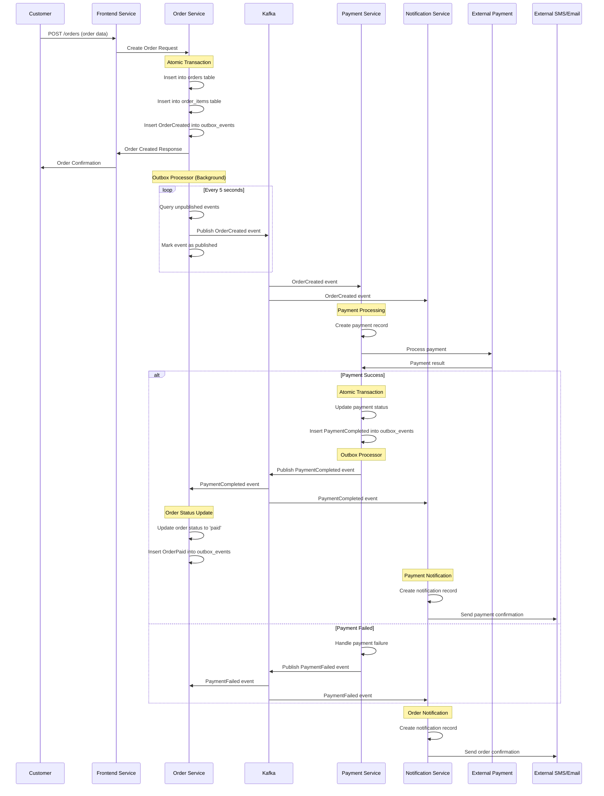

# Флоу сообщений - Процесс заказа пиццы

## Обзор

Данный документ описывает детальный поток сообщений в event-driven архитектуре системы заказа пиццы. Система использует паттерн Outbox для обеспечения консистентности данных и Apache Kafka для асинхронной обработки событий.

## Архитектурные принципы

### Event-Driven Architecture
- **Асинхронная обработка**: Сервисы взаимодействуют через события
- **Слабая связанность**: Сервисы не знают друг о друге напрямую
- **Eventual Consistency**: Консистентность достигается со временем

### Outbox Pattern
- **Транзакционная безопасность**: События сохраняются в той же транзакции, что и бизнес-данные
- **Гарантированная доставка**: События публикуются в Kafka через фоновый процесс
- **Идемпотентность**: Повторная обработка событий безопасна

## Детальный флоу заказа

### 1. Создание заказа

**Инициатор**: Customer через Web Browser
**Сервис**: Frontend Service → Order Service

```
POST /api/v1/orders
{
  "customer_name": "Иван Иванов",
  "customer_email": "ivan@example.com",
  "customer_phone": "+7-900-123-45-67",
  "items": [
    {
      "pizza_id": "uuid-pizza-1",
      "quantity": 2,
      "size": "large"
    }
  ],
  "delivery_address": "ул. Пушкина, д. 10"
}
```

**Обработка в Order Service**:
1. Валидация данных заказа
2. Расчет общей стоимости
3. **Атомарная транзакция**:
   - Создание записи в таблице `orders`
   - Создание записей в таблице `order_items`
   - **Создание события в таблице `outbox_events`**:

```sql
BEGIN;

INSERT INTO orders (id, customer_name, customer_email, total_amount, status, created_at)
VALUES ('order-uuid', 'Иван Иванов', 'ivan@example.com', 1200.00, 'pending', NOW());

INSERT INTO order_items (order_id, pizza_id, quantity, size, price)
VALUES ('order-uuid', 'pizza-uuid', 2, 'large', 600.00);

INSERT INTO outbox_events (id, aggregate_id, event_type, event_data, created_at)
VALUES (
  'event-uuid',
  'order-uuid',
  'OrderCreated',
  '{
    "order_id": "order-uuid",
    "customer_name": "Иван Иванов",
    "customer_email": "ivan@example.com",
    "customer_phone": "+7-900-123-45-67",
    "total_amount": 1200.00,
    "items": [...],
    "delivery_address": "ул. Пушкина, д. 10",
    "created_at": "2024-01-15T10:30:00Z"
  }',
  NOW()
);

COMMIT;
```

### 2. Публикация события OrderCreated

**Процесс**: Outbox Processor (фоновый поток в Order Service)

```python
# Outbox Processor каждые 5 секунд
while True:
    unpublished_events = db.query(
        "SELECT * FROM outbox_events WHERE published_at IS NULL ORDER BY created_at"
    )
    
    for event in unpublished_events:
        try:
            # Публикация в Kafka
            kafka_producer.send(
                topic='order-events',
                key=event.aggregate_id,
                value={
                    'event_id': event.id,
                    'event_type': event.event_type,
                    'aggregate_id': event.aggregate_id,
                    'event_data': json.loads(event.event_data),
                    'timestamp': event.created_at.isoformat()
                }
            )
            
            # Отметка о публикации
            db.execute(
                "UPDATE outbox_events SET published_at = NOW() WHERE id = %s",
                (event.id,)
            )
            
        except Exception as e:
            logger.error(f"Failed to publish event {event.id}: {e}")
    
    time.sleep(5)
```

### 3. Обработка платежа

**Сервис**: Payment Service
**Kafka Consumer**: Подписан на топик `order-events`

```python
# Payment Service Event Consumer
@kafka_consumer.subscribe(['order-events'])
def handle_order_event(message):
    event = message.value
    
    if event['event_type'] == 'OrderCreated':
        order_data = event['event_data']
        
        # Создание платежной записи
        payment_id = create_payment_record(
            order_id=order_data['order_id'],
            amount=order_data['total_amount'],
            customer_email=order_data['customer_email']
        )
        
        # Обработка платежа через внешний провайдер
        try:
            payment_result = external_payment_provider.process_payment(
                amount=order_data['total_amount'],
                customer_email=order_data['customer_email'],
                order_reference=order_data['order_id']
            )
            
            if payment_result.success:
                # Атомарная транзакция: обновление статуса + создание события
                with db.transaction():
                    update_payment_status(payment_id, 'completed')
                    create_outbox_event(
                        aggregate_id=payment_id,
                        event_type='PaymentCompleted',
                        event_data={
                            'payment_id': payment_id,
                            'order_id': order_data['order_id'],
                            'amount': order_data['total_amount'],
                            'transaction_id': payment_result.transaction_id,
                            'completed_at': datetime.utcnow().isoformat()
                        }
                    )
            else:
                # Обработка неудачного платежа
                handle_payment_failure(payment_id, payment_result.error)
                
        except Exception as e:
            logger.error(f"Payment processing failed for order {order_data['order_id']}: {e}")
            handle_payment_error(payment_id, str(e))
```

### 4. Обновление статуса заказа

**Сервис**: Order Service
**Kafka Consumer**: Подписан на топик `payment-events`

```python
# Order Service Event Consumer
@kafka_consumer.subscribe(['payment-events'])
def handle_payment_event(message):
    event = message.value
    
    if event['event_type'] == 'PaymentCompleted':
        payment_data = event['event_data']
        order_id = payment_data['order_id']
        
        # Атомарная транзакция: обновление заказа + создание события
        with db.transaction():
            db.execute(
                "UPDATE orders SET status = 'paid', updated_at = NOW() WHERE id = %s",
                (order_id,)
            )
            
            create_outbox_event(
                aggregate_id=order_id,
                event_type='OrderPaid',
                event_data={
                    'order_id': order_id,
                    'payment_id': payment_data['payment_id'],
                    'amount': payment_data['amount'],
                    'paid_at': datetime.utcnow().isoformat()
                }
            )
```

### 5. Отправка уведомлений

**Сервис**: Notification Service
**Kafka Consumer**: Подписан на топики `order-events` и `payment-events`

```python
# Notification Service Event Consumer
@kafka_consumer.subscribe(['order-events', 'payment-events'])
def handle_notification_events(message):
    event = message.value
    
    if event['event_type'] == 'OrderCreated':
        send_order_confirmation_notification(event['event_data'])
    
    elif event['event_type'] == 'PaymentCompleted':
        send_payment_confirmation_notification(event['event_data'])

def send_order_confirmation_notification(order_data):
    # Создание уведомления в БД
    notification_id = create_notification(
        type='order_confirmation',
        recipient_email=order_data['customer_email'],
        recipient_phone=order_data['customer_phone'],
        template_data={
            'customer_name': order_data['customer_name'],
            'order_id': order_data['order_id'],
            'total_amount': order_data['total_amount'],
            'items': order_data['items']
        }
    )
    
    # Асинхронная отправка
    send_notification_async(notification_id)

def send_notification_async(notification_id):
    notification = get_notification(notification_id)
    template = get_template(notification.type)
    
    try:
        # Email уведомление
        if notification.recipient_email:
            email_content = render_template(template.email_template, notification.template_data)
            email_service.send(
                to=notification.recipient_email,
                subject=template.email_subject,
                content=email_content
            )
            
            record_delivery(
                notification_id=notification_id,
                channel='email',
                status='sent'
            )
        
        # SMS уведомление
        if notification.recipient_phone:
            sms_content = render_template(template.sms_template, notification.template_data)
            sms_service.send(
                to=notification.recipient_phone,
                message=sms_content
            )
            
            record_delivery(
                notification_id=notification_id,
                channel='sms',
                status='sent'
            )
            
    except Exception as e:
        logger.error(f"Failed to send notification {notification_id}: {e}")
        record_delivery(
            notification_id=notification_id,
            channel='email' if notification.recipient_email else 'sms',
            status='failed',
            error_message=str(e)
        )
```

## Диаграмма последовательности



## Обработка ошибок и retry логика

### Kafka Consumer Error Handling

```python
class RobustKafkaConsumer:
    def __init__(self, topics, max_retries=3, retry_delay=5):
        self.topics = topics
        self.max_retries = max_retries
        self.retry_delay = retry_delay
        self.consumer = KafkaConsumer(
            *topics,
            enable_auto_commit=False,  # Ручное управление коммитами
            auto_offset_reset='earliest'
        )
    
    def process_messages(self):
        for message in self.consumer:
            retry_count = 0
            
            while retry_count < self.max_retries:
                try:
                    # Обработка сообщения
                    self.handle_message(message)
                    
                    # Коммит только после успешной обработки
                    self.consumer.commit()
                    break
                    
                except Exception as e:
                    retry_count += 1
                    logger.warning(
                        f"Message processing failed (attempt {retry_count}/{self.max_retries}): {e}"
                    )
                    
                    if retry_count < self.max_retries:
                        time.sleep(self.retry_delay * retry_count)  # Exponential backoff
                    else:
                        # Отправка в Dead Letter Queue
                        self.send_to_dlq(message, str(e))
                        self.consumer.commit()  # Коммит для перехода к следующему сообщению
```

### Dead Letter Queue

```python
def send_to_dlq(self, message, error_reason):
    dlq_message = {
        'original_topic': message.topic,
        'original_partition': message.partition,
        'original_offset': message.offset,
        'original_message': message.value,
        'error_reason': error_reason,
        'failed_at': datetime.utcnow().isoformat(),
        'retry_count': self.max_retries
    }
    
    self.dlq_producer.send(
        topic=f"{message.topic}-dlq",
        value=dlq_message
    )
```

## Мониторинг и метрики

### Ключевые метрики

1. **Outbox Events**:
   - Количество неопубликованных событий
   - Время задержки публикации
   - Частота ошибок публикации

2. **Kafka Consumer Lag**:
   - Задержка обработки сообщений по топикам
   - Throughput обработки

3. **Business Metrics**:
   - Время обработки заказа (end-to-end)
   - Процент успешных платежей
   - Время доставки уведомлений

### Логирование

```python
# Структурированное логирование событий
logger.info(
    "Event published",
    extra={
        'event_id': event.id,
        'event_type': event.event_type,
        'aggregate_id': event.aggregate_id,
        'topic': 'order-events',
        'timestamp': datetime.utcnow().isoformat()
    }
)

logger.info(
    "Event processed",
    extra={
        'event_id': message.value['event_id'],
        'event_type': message.value['event_type'],
        'processing_time_ms': processing_time,
        'consumer_group': 'payment-service',
        'timestamp': datetime.utcnow().isoformat()
    }
)
```

## Заключение

Данная event-driven архитектура обеспечивает:

- **Надежность**: Outbox pattern гарантирует доставку событий
- **Масштабируемость**: Асинхронная обработка через Kafka
- **Отказоустойчивость**: Retry логика и Dead Letter Queue
- **Наблюдаемость**: Детальное логирование и метрики
- **Консистентность**: Eventual consistency через события

Система готова к горизонтальному масштабированию и может обрабатывать высокие нагрузки при сохранении целостности данных.